# MADAD

## For quickly viewing the final product (Screenshorts of android app ) start viewing from the last slides of the presentation

 
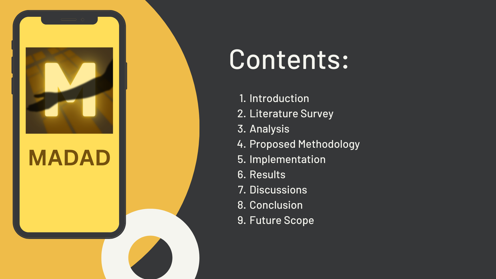 
 
 
 

 
 
 
 
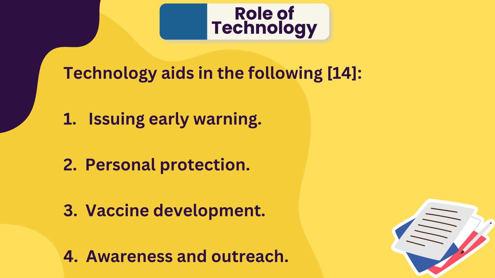 
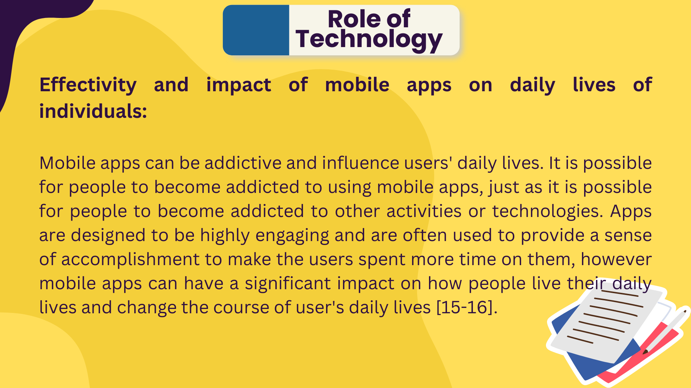 
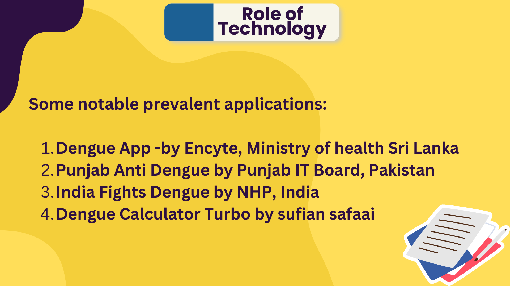 
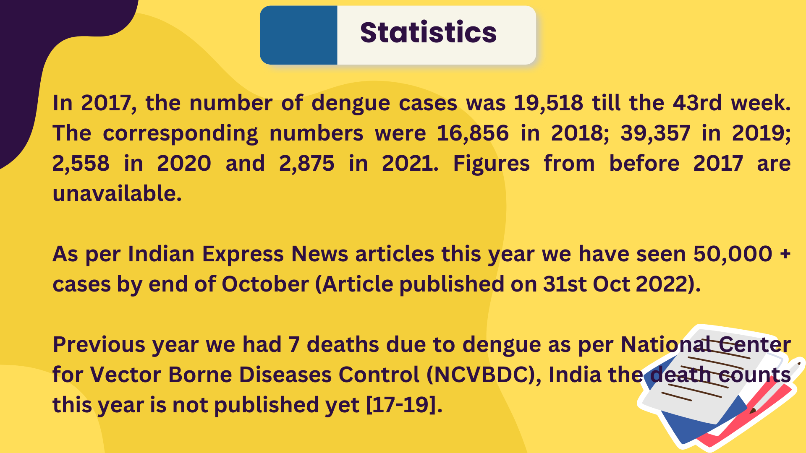 
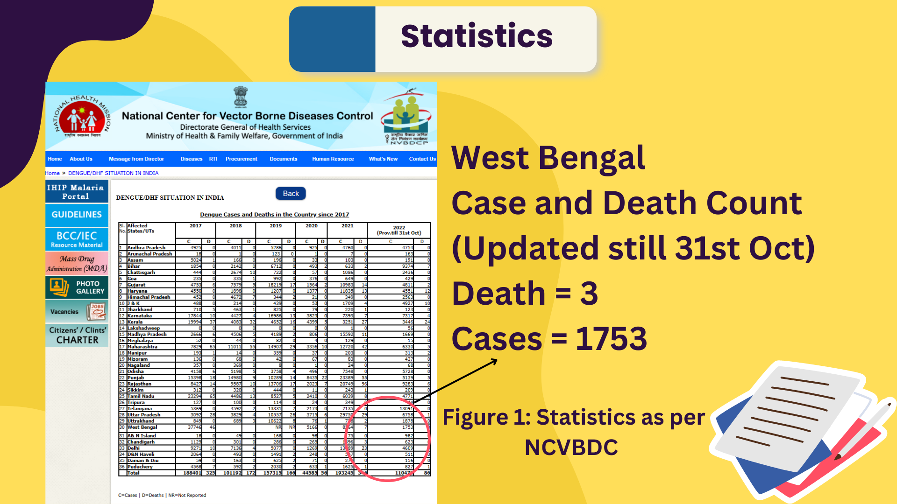 
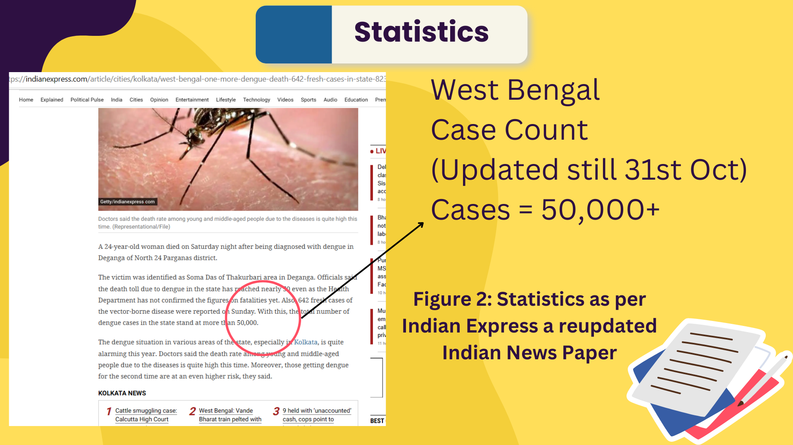 
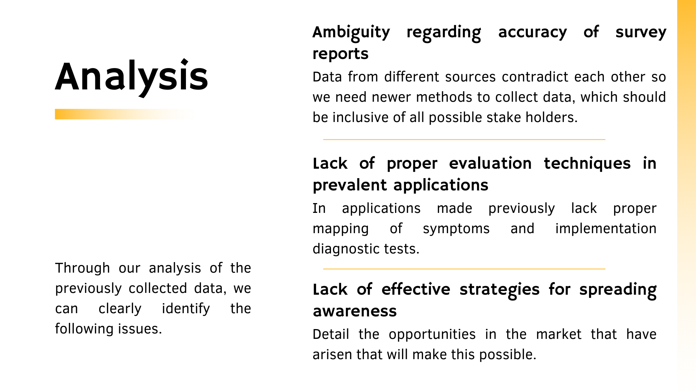 
 
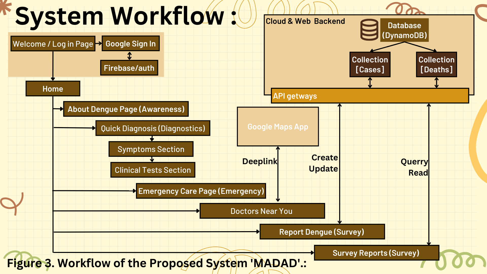 
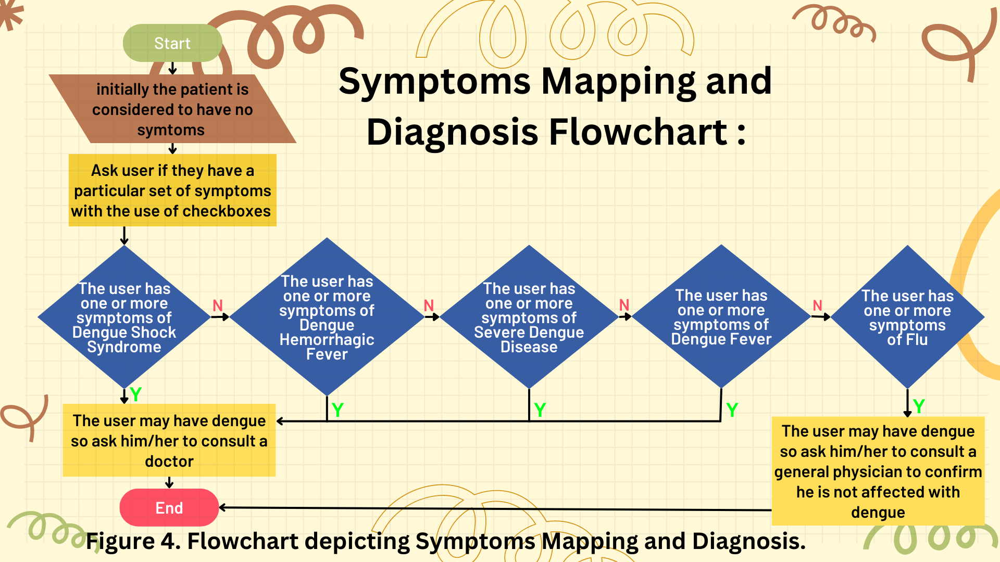 
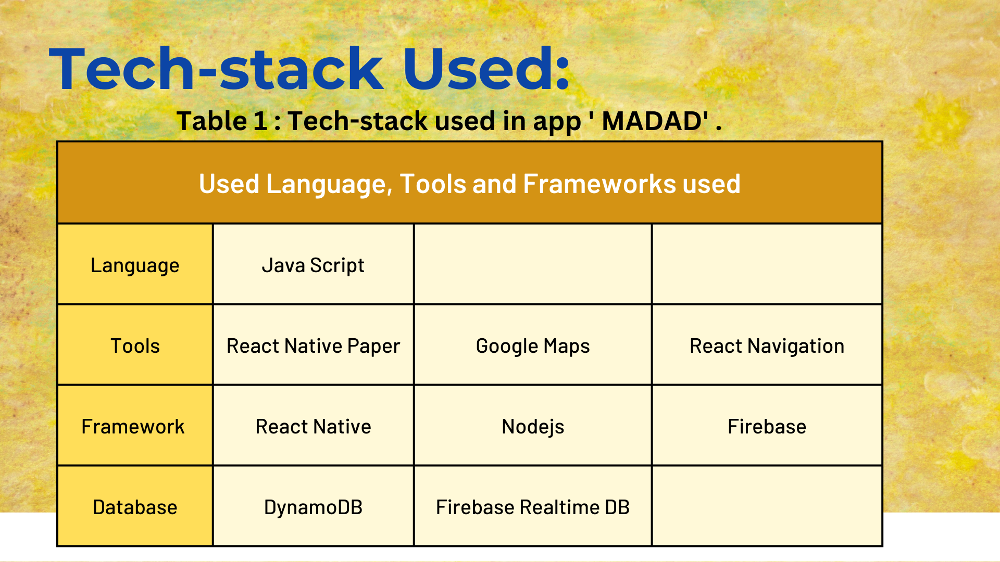 
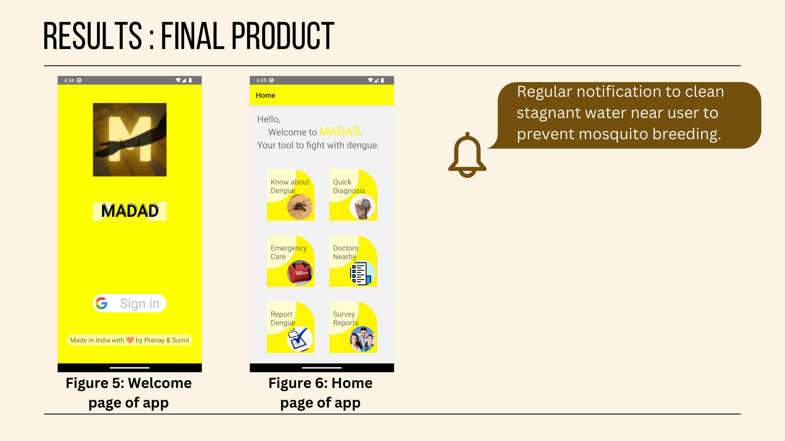
.png) 
.png) 
 
 
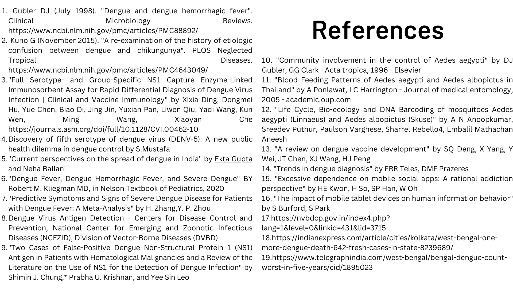 

